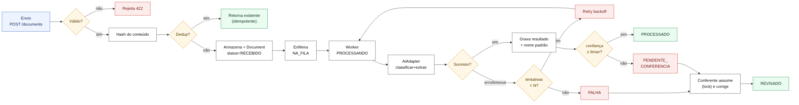
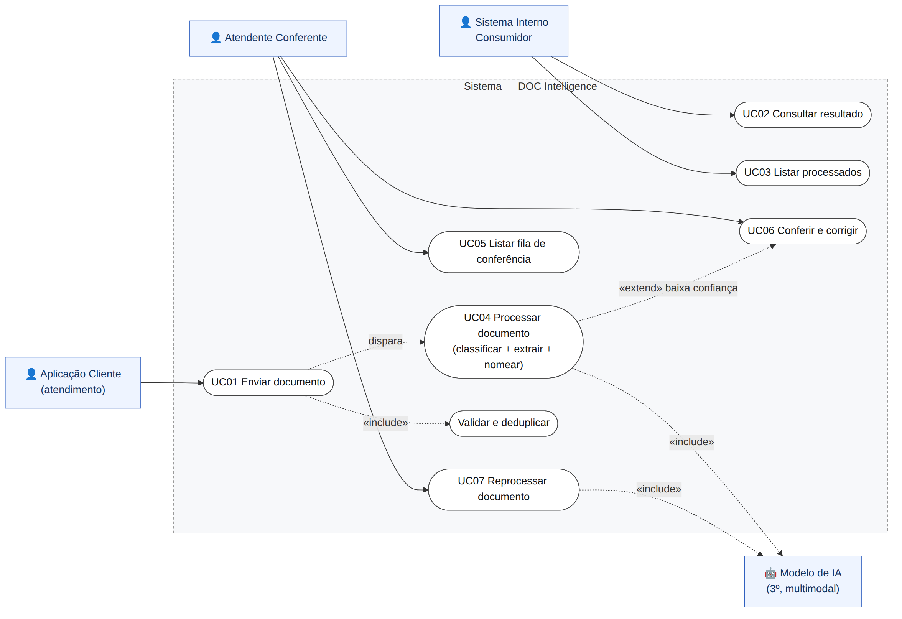
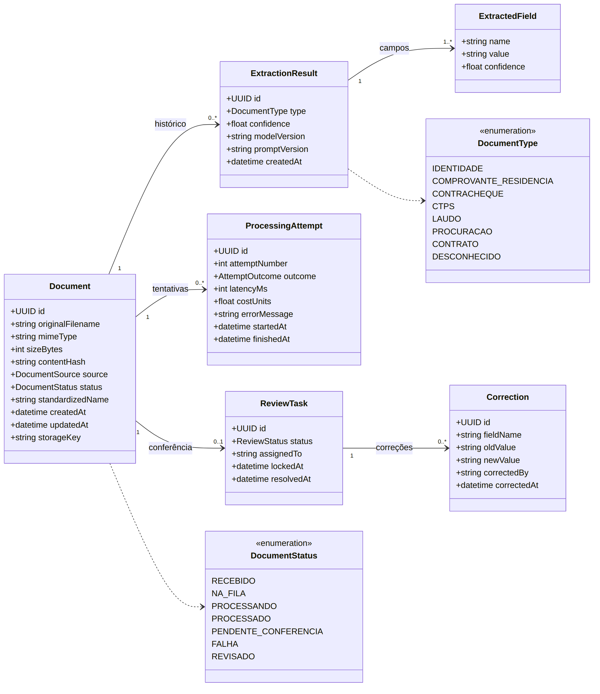
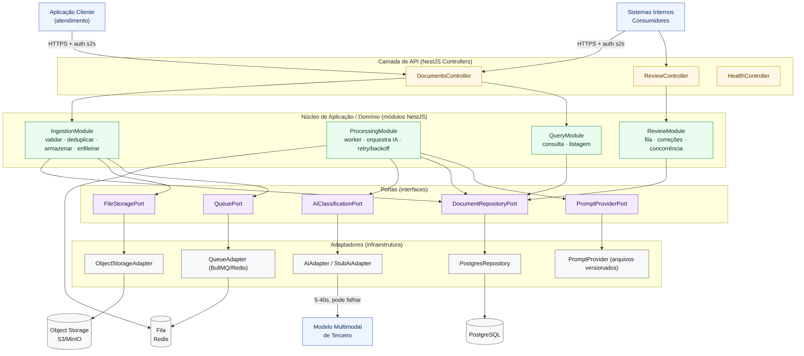

# DOC Intelligence — Especificação (spec-first)

> Projeto de engenharia escrito **antes** de programar: requisitos, fluxo do sistema e
> modelagem UML. Trilha A (back-end) · Stack: Node + NestJS (TypeScript).
>
> Se a implementação divergir desta especificação, a spec é mantida como estava e a
> divergência é anotada onde ocorrer.

## 1. Visão geral e contexto

O escritório recebe, todos os dias, documentos de clientes por três canais — o WhatsApp
do atendimento, o e-mail e o balcão: identidades, comprovantes de residência,
contracheques, carteiras de trabalho, laudos, procurações, contratos e fotografias tortas
desses mesmos papéis. Hoje a triagem é manual: uma pessoa abre cada arquivo, descobre o
que é, renomeia num padrão interno e digita os dados numa planilha — cerca de quatro
minutos por documento, e o volume cresce.

O **DOC Intelligence** substitui esse trabalho por um serviço: recebe o documento,
descobre o tipo, extrai os campos de interesse, propõe um nome de arquivo padronizado,
permite consultar/listar o que já foi processado e retém o documento para conferência
humana quando a máquina não tem confiança. É consumido por sistemas internos, não por um
navegador anônimo na internet aberta.

## 2. Escopo da entrega e método

Distinção fundamental:

- **Produto-alvo** — os cinco comportamentos completos do serviço. É o alvo que a
  arquitetura precisa alcançar, não o que se entrega agora.
- **Escopo desta entrega** — o projeto do sistema (esta spec + os ADRs) e **uma fatia
  vertical** implementada: um caminho completo de ponta a ponta, ainda que estreito, com
  o modelo de IA representado por um **dublê** determinístico.

Trilha escolhida: **A — back-end** (API, processamento e persistência). O consumo por
interface gráfica não faz parte; o contrato exposto, sim. O que não for feito é declarado
como não feito — resolvido **ou** registrado conscientemente como risco conhecido.

## 3. Requisitos funcionais

Escopo: `Fatia` = entra na fatia vertical · `Contrato` = projetado, não implementado ·

| ID | Requisito funcional | Escopo |
|----|---------------------|--------|
| RF01 | Receber um documento (imagem ou PDF) enviado por uma aplicação cliente, via API. | Fatia |
| RF02 | Registrar o documento com metadados: nome original, MIME, tamanho, canal de origem, hash e status. | Fatia |
| RF03 | Deduplicar reenvios pelo hash do conteúdo e não reprocessar. | Fatia |
| RF04 | Enfileirar o documento para processamento assíncrono. | Fatia |
| RF05 | Classificar o tipo do documento por meio de um modelo multimodal. | Fatia (dublê) |
| RF06 | Extrair os campos de interesse conforme o tipo. | Fatia (dublê) |
| RF07 | Propor um nome de arquivo padronizado. | Fatia |
| RF08 | Registrar o nível de confiança de cada resultado. | Fatia |
| RF09 | Reter para conferência quando a confiança for menor que o limiar. | Fatia |
| RF10 | Consultar o resultado de um documento específico. | Fatia |
| RF11 | Listar documentos processados, com filtros e paginação. | Fatia |
| RF12 | Listar a fila de conferência. | Contrato |
| RF13 | Conferir e corrigir: documento ao lado dos campos extraídos, corrigir e aprovar. | Contrato |
| RF14 | Controlar concorrência na fila (claim/lock de item). | Contrato |
| RF15 | Tratar falha/timeout do modelo com retry (backoff); após N tentativas, marcar falha. | Fatia (parcial) |
| RF16 | Reprocessar um documento (troca de modelo/prompt). | Contrato |
| RF17 | Expor o serviço apenas a sistemas internos autenticados. | Contrato |
| RF18 | Versionar, por documento, a versão de modelo e de prompt usadas. | Fatia |

## 4. Requisitos não funcionais

Nascem, em sua maioria, dos "fatos do ambiente". Cada RNF aponta o fato que o motiva.

| ID | Categoria | Requisito não funcional | Fato |
|----|-----------|-------------------------|------|
| RNF01 | Desempenho/Carga | Suportar 150 docs/dia e picos de 800 entre 9h–11h via processamento assíncrono e workers escaláveis. | (e) |
| RNF02 | Resiliência | Tolerar IA de 5–40 s que às vezes falha: timeout, retry com backoff, dead-letter, isolamento de falhas. | (a) |
| RNF03 | Idempotência | Mesmo documento repetido não gera reprocessamento nem duplicidade (chave por hash). | (c) |
| RNF04 | Privacidade (LGPD) | Dado pessoal e sensível: cripto em trânsito/repouso, acesso restrito, minimização, retenção, logs sem conteúdo. | (d) |
| RNF05 | Segurança de acesso | Exposto só a sistemas internos autenticados (serviço-a-serviço), sem superfície pública. | (item 5) |
| RNF06 | Manutenibilidade | IA atrás de uma porta; prompts externalizados e versionados; trocar modelo/prompt não afeta o resto. | (f) |
| RNF07 | Concorrência | Duas ou mais pessoas operam a fila sem conflito (lock/claim). | (g) |
| RNF08 | Robustez de entrada | Não confiar no cliente: validar tipo/tamanho, normalizar, ignorar o nome de arquivo recebido. | (b) |
| RNF09 | Observabilidade | Logs estruturados e métricas por documento (latência, erro, fila, custo), rastreamento fim a fim. | (a,e) |
| RNF10 | Custo | Cobrança por documento: evitar chamadas desnecessárias (dedup, cache) e contabilizar custo. | (a,c) |
| RNF11 | Testabilidade | Substituir o modelo real por um dublê determinístico para testar todo o fluxo sem IA nem rede. | (a,f) |
| RNF12 | Portabilidade | Empacotar em contêineres, com configuração por ambiente. | — |

## 5. Fatos do ambiente → tratamento

Nenhum fato pede diretamente uma funcionalidade — e é por isso que são o ponto mais
importante. "Tratar" pode ser **resolver** ou **registrar como risco conhecido**.

| Fato | O que é | Tratamento |
|------|---------|-----------|
| (a) | IA de terceiro, 5–40 s, cobrada, às vezes falha. | **Resolvido:** assíncrono, timeout + retry/backoff, dead-letter; adapter isola a chamada; custo por tentativa. |
| (b) | Cliente não valida nada; foto crua, nome arbitrário. | **Resolvido:** validação de tipo/tamanho; nome padronizado derivado do conteúdo, nunca do nome recebido. |
| (c) | Mesmo documento chega mais de uma vez. | **Resolvido:** dedup por hash + operação idempotente; reenvio retorna o registro existente. |
| (d) | Conteúdo é dado pessoal e sensível. | **Resolvido (LGPD):** cripto em trânsito/repouso, acesso restrito, retenção, logs sem conteúdo. Cripto de campo: **risco registrado**. |
| (e) | 150/dia; picos de 800 entre 9h–11h. | **Resolvido:** fila desacoplada absorve o pico; workers escalam. Autoscaling por profundidade de fila: **risco registrado**. |
| (f) | Modelo troca de versão; prompts mudam. | **Resolvido:** IA atrás de `AiClassificationPort`; prompts versionados; versão gravada por resultado. |
| (g) | Duas pessoas na fila ao mesmo tempo. | **Projetado (contrato):** claim/lock de item. Implementação fora da fatia: **risco registrado**. |

## 6. Fluxo do sistema

**Principal (caminho feliz):** envio → validação → hash/dedup → armazenamento +
`Document(RECEBIDO)` → fila → worker → IA (classificar+extrair) → grava resultado + nome
padrão → confiança ≥ limiar → `PROCESSADO` → consulta.

Alternativos:

- **A1 (falha da IA):** erro/timeout → retry com backoff; após N tentativas → `FALHA`,
  encaminhado à conferência/reprocesso.
- **A2 (dedup):** documento repetido → retorna o registro existente, sem reprocessar.
- **A3 (baixa confiança):** confiança < limiar → `PENDENTE_CONFERENCIA` → conferente
  assume (lock), corrige campos → `REVISADO`.

*Figura 4 — Fluxo ponta a ponta: caminho principal e alternativos.*

## 7. Diagrama de casos de uso

*Figura 1 — Casos de uso e atores.*

| Ator | Casos de uso |
|------|--------------|
| Aplicação Cliente | UC01 Enviar documento (inclui Validar e deduplicar; dispara UC04). |
| Sistemas Internos Consumidores | UC02 Consultar resultado; UC03 Listar processados. |
| Atendente Conferente | UC05 Listar fila; UC06 Conferir e corrigir; UC07 Reprocessar. |
| Modelo de IA (secundário) | Participa de UC04 e UC07 (relação «include»). |

## 8. Diagrama de classes (modelo de domínio)

*Figura 2 — Modelo de domínio.*

A entidade central é **Document** (metadados, status, nome padronizado). Cada tentativa de
processamento é registrada em **ProcessingAttempt** (número, desfecho, latência, custo,
erro). O resultado bem-sucedido é um **ExtractionResult** (tipo, confiança, versão de
modelo e de prompt) composto por vários **ExtractedField**. Ao cair para revisão, abre-se
uma **ReviewTask** (responsável, lock) que acumula **Correction**.

Invariantes: um `Document` só transita para `PROCESSADO` quando há `ExtractionResult` com
confiança ≥ limiar; caso contrário vai para `PENDENTE_CONFERENCIA`. O `contentHash` é
único por documento lógico, sustentando a deduplicação (RF03/RNF03).

## 9. Diagrama de componentes (arquitetura)

*Figura 3 — Camadas com Ports & Adapters (hexagonal).*

Estilo **Ports & Adapters (hexagonal)**, resposta direta ao fato (f): o núcleo depende só
de **portas** (interfaces); a infraestrutura fica em **adaptadores** substituíveis. Trocar
IA, banco, storage ou fila é trocar um adaptador — e é o que permite rodar a fatia com um
`StubAiAdapter`.

- **API (Controllers NestJS):** `DocumentsController`, `ReviewController`, `HealthController`.
- **Núcleo/domínio (módulos):** `IngestionModule`, `ProcessingModule`, `ReviewModule`, `QueryModule`.
- **Portas:** `AiClassificationPort`, `DocumentRepositoryPort`, `FileStoragePort`, `QueuePort`, `PromptProviderPort`.
- **Adaptadores:** `AiAdapter`/`StubAiAdapter`, `PostgresRepository`, `ObjectStorageAdapter` (S3/MinIO), `QueueAdapter` (BullMQ/Redis), `PromptProvider`.

## 10. Contrato da API (esboço)

| Método e rota | Descrição | Notas |
|---------------|-----------|-------|
| `POST /v1/documents` | Envia um documento (multipart). | 202; retorna id e status. Idempotente por hash. |
| `GET /v1/documents/{id}` | Consulta o resultado de um documento. | Tipo, campos, confiança, nome padrão, status. |
| `GET /v1/documents` | Lista documentos processados. | Filtros: status, tipo, data; paginação. |
| `GET /v1/reviews` | Lista a fila de conferência. | Contrato (fora da fatia). |
| `POST /v1/reviews/{id}/claim` | Assume um item da fila (lock). | Concorrência — fato (g). |
| `PATCH /v1/reviews/{id}` | Correções de campos + decisão. | Aprova → REVISADO. |
| `POST /v1/documents/{id}/reprocess` | Reprocessa um documento. | Após troca de modelo/prompt — fato (f). |
| `GET /health` | Saúde do serviço. | Liveness/readiness. |

## 11. Stack e justificativa

Adotamos **Node + NestJS (TypeScript)**:

- **NestJS favorece a arquitetura pretendida:** módulos, injeção de dependência e
  providers tornam Ports & Adapters natural (portas = interfaces; adaptadores = providers
  trocáveis por configuração — crucial para o dublê e para a troca de modelo).
- **Assíncrono + BullMQ:** o modelo de I/O do Node e o BullMQ (sobre Redis) atendem ao
  desacoplamento por fila (fatos a, e).
- **TypeScript** tipa o contrato da API e o domínio, reduzindo erro num serviço que
  integra terceiros instáveis.

Alternativas descartadas para este cenário: **Python/FastAPI** (ótimo para IA, mas a
modularidade forte do Nest facilita demonstrar fronteiras entre módulos); **PHP/Laravel**
(filas maduras, porém menos natural para orquestração multimodal); **Java/Spring Boot**
(robusto, mas verboso demais para uma fatia estreita em três dias).

## 12. Decisões de arquitetura

Detalhadas em [`adr/`](adr/). Resumo:

| ADR | Decisão | Alternativa descartada |
|-----|---------|------------------------|
| 0001 | Processamento assíncrono via fila. | Processar de forma síncrona na requisição. |
| 0002 | Ports & Adapters isolando IA, banco, storage e fila. | Acesso direto às libs no domínio. |
| 0003 | Deduplicação por hash + idempotência. | Confiar no nome do arquivo / permitir duplicatas. |
| 0004 | Prompts externalizados e versionados. | Prompts embutidos no código. |
| 0005 | Limiar de confiança roteando para conferência. | Aceitar tudo que a IA devolve. |
| 0006 | Object storage para binários; banco só para metadados. | Guardar o binário no banco. |

## 13. Escopo da fatia vertical a implementar

- **Um tipo** (identidade) percorrendo todo o fluxo, com `StubAiAdapter` determinístico.
- `POST /v1/documents` → validação → hash/dedup → armazenamento → `Document(RECEBIDO)` → fila.
- Worker consome, chama o dublê, grava `ExtractionResult` + nome padrão, aplica o limiar.
- `GET /v1/documents/{id}` e `GET /v1/documents`.

**Fora da fatia (registrado, não escondido):** interface gráfica; autenticação real (guard
como contrato); operação completa da fila com concorrência; múltiplos tipos; reprocesso em
massa; cobertura alta de testes — priorizamos um teste do caminho crítico (dedup e
roteamento por confiança) a muitos testes rasos.

## 14. Estrutura do repositório

Ver o `README.md` na raiz. A pasta `src/` recebe a fatia vertical no próximo ciclo.

## 15. Próximos passos

1. Esqueleto NestJS com histórico de commits real.
2. Domínio e portas.
3. Ingestão com dedup + worker com dublê.
4. Consultas.
5. Dois testes do caminho crítico.
6. Manter ADRs e registro de uso de IA atualizados; carta de fechamento ao final.
